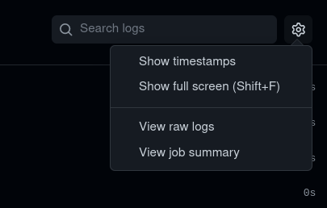
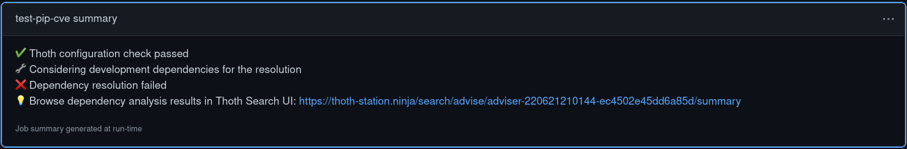

# 💡Thoth Adviser GitHub Action

Get Thoth security guidance on your Python project dependencies.

## Usage

The Thoth Adviser GitHub Action is meant to be used within a CI workflow to detect potential security vulnerabilities in the project dependencies.

The example below shows a basic usage of the action within a workflow (created under the `.github/workflows/` directory) triggered on a `push` event on the repository:

```
name: Your CI workflow
on:
  push:
    paths:
      - 'Pipfile'
jobs:
  validate-dependencies:
    runs-on: ubuntu-latest
    container: quay.io/thoth-station/s2i-thoth-ubi8-py38:latest
    name: Get Thoth recommendations on your dependencies
    steps:
      - uses: actions/checkout@v3
      - name: Get Thoth security recommendations
        uses: thoth-station/thoth-github-action@v0.1.1
        with:
          requirements-format: pipenv
          generate-summary: true
          ignore-cve: PYSEC-2021-94,PYSEC-2021-2
          consider-dev-dependencies: true
```

This action can be configured to run on a push event if the requirements file specifying a project dependencies has been modified by the current pull request or commit. In the `on.push.paths` field, specify the path of the requirements file in the repository (supported formats are `Pipfile`, `requirements.txt` and `setup.cfg`).

The `thoth-github-action` should be run using a `s2i-thoth` container image such as `quay.io/thoth-station/s2i-thoth-ubi8-py38:latest` as stated in the example workflow file above.
These container images contain a ready-to-use Python environment with pre-installed packages necessary to get Thoth advise on the repository dependencies. For more information on Thoth container images, see the [s2i-thoth repository](https://github.com/thoth-station/s2i-thoth#s2i-thoth).

Before running the action, steps should include checking out the current repository with `actions/checkout@v3`.

The action workflow succeeds if the specified dependencies could be properly resolved and fails if security issues or incompatibilities between dependencies are preventing the resolution, producing an error message and and blocking the Pull Request merge if configured to do so.

### Input parameters

- `requirements-format`: Dependency requirements format, among `pip`, `pipenv` or `setup.cfg`.
  The name of your requirements file should match the requirements format specified: `requirements.txt` for `pip`, `Pipfile` for `pipenv` and `setup.cfg` for `setup.cfg`.

- `generate-summary`: Generate a summary of Thoth Advise in the action section ([see GitHub Summaries documentation](https://github.blog/2022-05-09-supercharging-github-actions-with-job-summaries/)).

- `ignore-cve`: Ignore known CVE during the dependency resolution. CVE should be specified as a comma separated list. Example: `PYSEC-2021-94,PYSEC-2021-2`.

- `consider-dev-dependencies`: Consider development dependencies during the resolution.

- `runtime-environment`: Runtime environment used for dependency analysis. Thoth can analyze your dependencies against different runtime environments:
  - `ubi-8-py-3.8`
  - `rhel-8-py-3.8`
  - `fedora-35-py-3.10`
  - `fedora-34-py-3.9`


### Integrating Thoth into a CI workflow

When the Action is triggered on any push event, it is possible to block the merge of the Pull Request concerned in case of workflow failure.
To do so, navigate to your repository `Settings` and go to the `Branches` section.


Specify a pattern and rules to follow for branches you want to protect from unchecked merges in the `Branch protection rule` section. This will prevent branches with a name matching the pattern and pull requests not conforming to the rules specified to be merged without passing the Action check.


**Note:** Setting an action as a merge check requires to have the `pull_request` parameter specified in the workflow file as a trigger, with the names of the branches to be checked:

```
on:
  pull_request:
    branches: ["main"]
    paths:
      - "setup.cfg"
```

### Getting the job Summary

To see the job Summary for the Thoth Adviser Action, go to the Actions sections and select 'View job summary' in the top-right menu:






## Running the Action locally

It is possible to run a workflow that uses the Thoth Adviser GitHub Action locally with [`act`](https://github.com/nektos/act), without pushing or committing directly to the repository.
You can start using `act` by following the [installation instructions](https://github.com/nektos/act#installation).
Note that `act` requires Docker to be installed and that it does not currently support Podman. If you want to have Docker and Podman simultaneously installed on your system (RHEL8 or CentOS8), you can follow [this tutorial](https://medium.com/faun/how-to-install-simultaneously-docker-and-podman-on-rhel-8-centos-8-cb67412f321e).

When your workflows and actions are ready to be tested, use the [`act` command line interface](https://github.com/nektos/act#example-commands) to trigger the Action locally.

### Developing the Thoth Adviser GitHub Action

`act` can also be used to test the Action when developing it locally, to trigger the `test-action.yaml` workflow located in the `.github/workflows/` directory of the Action.

To test local changes made to the Action, it is necessary to commit and push those changes to the `master` branch of the repository and to specify manually the hash of the last commit in the `test-action.yaml` file, as variable substitution is not supported by GitHub Actions in the `uses:` field for security reasons.
To patch the `test-action.yaml` with your last commit hash, run the `helpers/patch_commit_sha_test.sh` file:

```
./helpers/patch_commit_sha_test.sh
```
