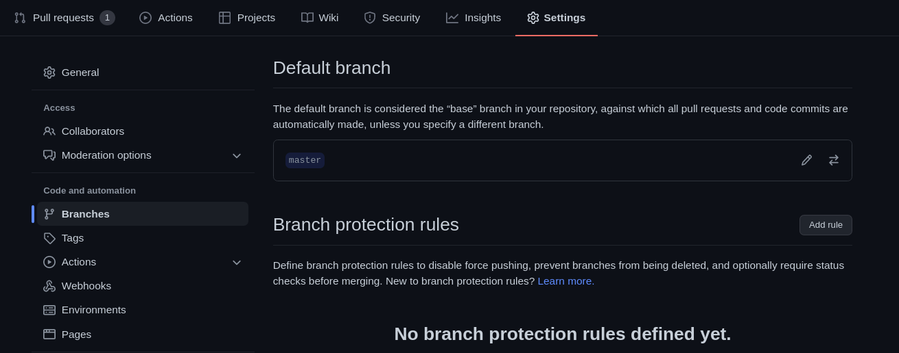
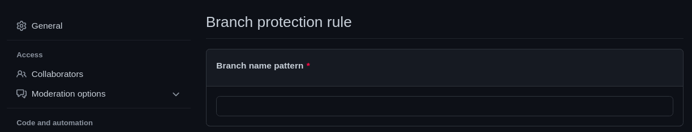

# Thoth Adviser GitHub Action

This is a test repository to provide Thoth security advise on a repository dependencies via a GitHub Action.

## Workflows and actions

This action is composed of a main workflow `.github/workflows/action.yaml` which triggers Thoth advise on dependencies present in the manifest file of the current repository on push.
The workflow succeeds if the specified dependencies could be properly resolved and fails if security issues or incompatibilities are preventing the resolution, producing an error message and and blocking the CI if configured to do so.

## Configuring the Action on a repository

When the Action is triggered on any push event, it is possible to block the pull request concerned in case of workflow failure.
To do so, navigate to your repository `Settings` and go to the `Branches` section.

Specify a pattern and rules to follow for branches you want to protect from unchecked merges in the `Branch protection rule` section. This will prevent branches with a name matching the pattern and pull requests not conforming to the rules specified to be merged without passing the Action check.

## Testing the Action locally

You can test the action locally using [`act`](https://github.com/nektos/act) without pushing or committing directly to the repository.
You can follow the installation instructions for `act` [here](https://github.com/nektos/act#installation).
Note that `act` requires Docker to be installed and that it does not currently support Podman. If you want to have Docker and Podman simultaneously installed on your system (RHEL8 or CentOS8), you can follow [this tutorial](https://medium.com/faun/how-to-install-simultaneously-docker-and-podman-on-rhel-8-centos-8-cb67412f321e).

When your workflows and actions are ready to be tested, use the [`act` command line interface](https://github.com/nektos/act#example-commands) to trigger the Action locally.
